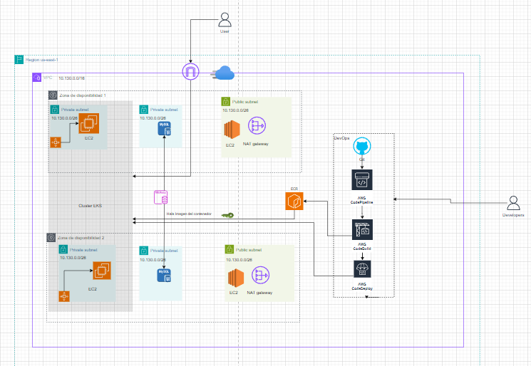

### Cloud-App – Cloud Architecture

This repository contains the final project of the Cloud Architecture Bootcamp. The repository is named Cloud-App, and it includes the creation of the base AWS infrastructure for deploying a containerized application on EKS.

### Table of Contents

- [Description](#description)
- [Prerequisites](#Prerequisites)
- [Installation](#Installation)
- [Usage](#Usage)
- [Architecture](#Architecture)

### Description

**Cloud-App** is a repository that contains three main folders with the source code for the implementation:

CloudAPP: Contains the deployment of the application infrastructure. Inside this folder, there is an example deployment of a Kubernetes deployment, service, and ingress on the base infrastructure.

Modules: Contains the Terraform modules for deploying the VPC, RDS, and EKS. The VPC module is local, while the others reference AWS provider modules for Terraform.

Templates: Infrastructure deployment files using AWS CodeBuild and CodePipeline services.

Together, these components enable the creation of the base infrastructure required for implementing the project, following the provided guidelines.

### Prerequisites

Before running the project, make sure you have the following requirements installed or available:

- [Requirement 1] - [An AWS account is required.]
- [Requirement 2] - [Basic knowledge of Terraform and AWS is required.]
- [Requirement 3] - [Use the modules and code found in this repository, taking into account the comments within the code for effective usage.]

## Installation

To clone and run this project on your local machine, follow these steps:

1. Create a directory to work on the project.
   ```bash
   mkdir Cloud-App
2. Move to the project directory.
   ```bash
   cd Cloud-App
3. Clone the repository::
   ```bash
   git clone https://github.com/CyberDev505/Cloud-App.git   
4. Start by applying the corresponding configurations

## Usage

You can quickly deploy an application using this repository. The base templates or modules allow you to deploy the required infrastructure with minimal adjustments.

## Architecture

The following image shows the architecture of the proposed solution, deployed using the code contained in this repository.

